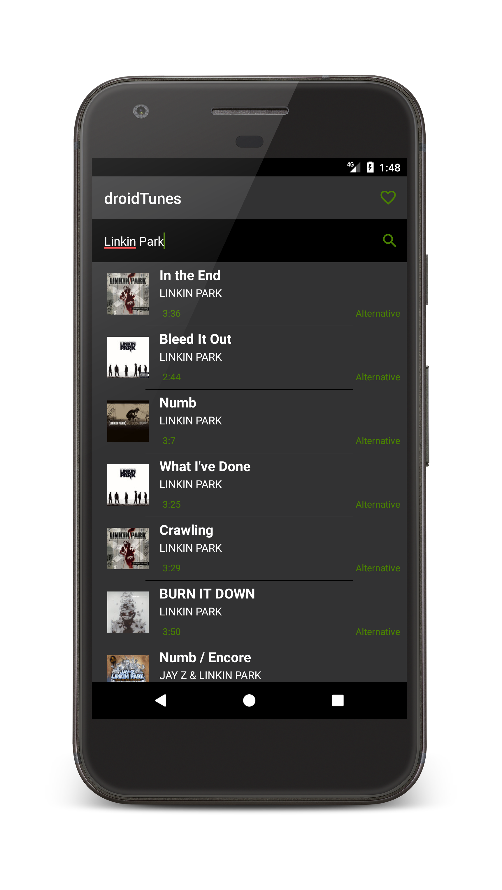
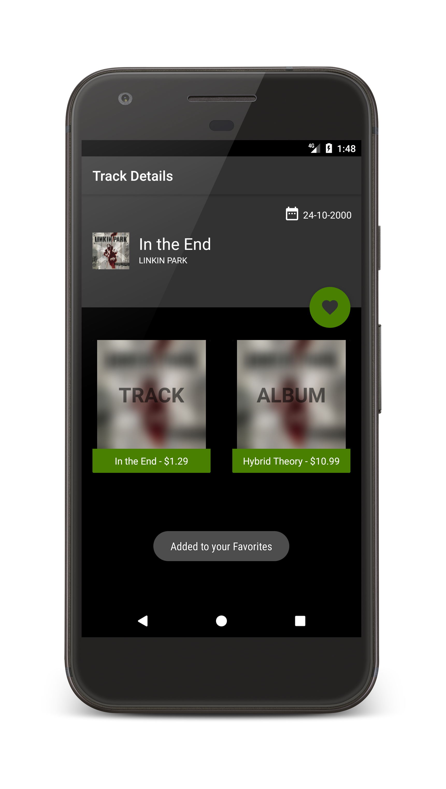
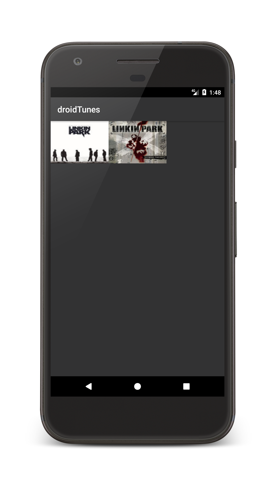
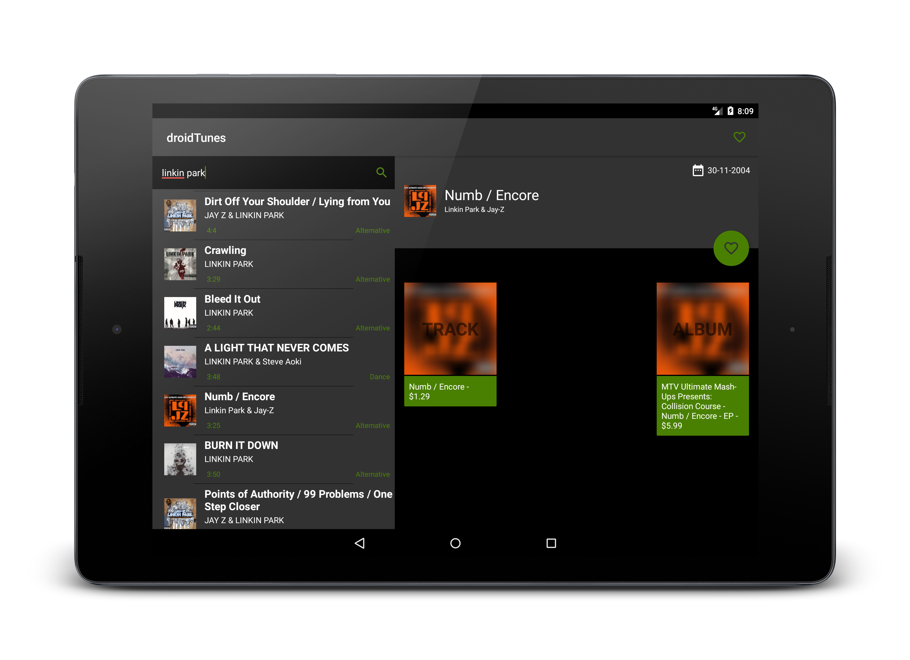

# droidTunes

Fetches data from iTunes Search API 

## Features

With the app, you can:

* Search for an artist/track
* Get details about the track
* Buy a single track/entire album from iTunes
* Mark a track as favorite

## Built with

* [Butter Knife](http://jakewharton.github.io/butterknife/) - For binding views
* [Picasso](http://square.github.io/picasso/) - For image loading and caching
* [Retrofit](http://square.github.io/retrofit/) - For network calls
* [LeakCanary](https://github.com/square/leakcanary) - For detecting memory leaks

## Architecture

* Provides an example for a basic Model-View-Presenter (MVP) architecture without using any architectural frameworks. 
* Act as a reference point for comparing and contrasting with other MVP architectural patterns.
* [Android Architecture](https://github.com/hsm59/android-architecture) - [todo-mvp](https://github.com/googlesamples/android-architecture/tree/todo-mvp/)

## Screenshots - Phone

## Screenshots - Tablet

## License

This project is licensed under the Apache License - see the [LICENSE.md](LICENSE.md) file for details
